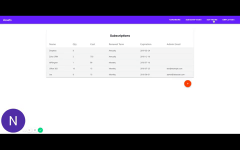

## Asset App (Grassets?)

The goal of this project was to create a simple, cheap solution for tracking company assets across offices. Primarily, it needed to track software subscriptions, desktop apps, and hardware. I was solely in charge of the design, development, and overall implementation of the solution.

### Back-End

I decided to use GraphCMS due to my time constraints, and the fact that they offer a free to low cost solution for low volume apps. GraphCMS allows you to create a GraphQL content model, store the content, and provide the api endpoints. In the future, I may want to build a custom solution as it does come with some limitations.

### Front-End

For the front end I used React.js, Apollo for client side queries, Material-UI, and rechart for the home page visualizations. The primary component was a table component that queried a limited data set for fast loading:

When a row was clicked, a more detailed query ran to populate the drawer form and relationships. From here the user could add links to related data. In this case, employees that were queried after the parent componet rendered. This allowed for quick response times, and the client looks for query information from the cache first to help keep the server requests down.

### What's Left

This was just a completion of the minimum specs. The next scope will include table controls like Pagination, sorting, and csv exports. I am also working on improving some of the architecture to make it more compositional and data agnostic.
